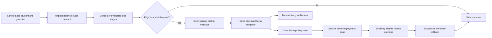

# Automatic WhatsApp Payment Reminders — Implementation Plan

**Status:** Implemented locally; production rollout gates remain open

**Goal:** Automatically remind the parent or guardian responsible for every unpaid student balance through Meta's WhatsApp Cloud API, without requiring a school to create a campaign or select students.

**Architecture:** A verified Minerval WhatsApp Business number sends approved utility templates on behalf of schools. Adding a student requires a guardian and an opted-in WhatsApp number. A scheduled Railway endpoint finds due balances, creates idempotent outbox rows, and sends them through Meta. Meta webhooks update delivery state. A successful SerdiPay callback cancels future reminders immediately.

**Tech stack:** Next.js 16, Supabase Postgres, Meta WhatsApp Cloud API, GitHub Actions scheduler, SerdiPay

---

## Product decisions

These decisions are fixed for the first implementation:

1. Use Meta's WhatsApp Cloud API directly. Do not add Twilio, SMS, email, or unofficial WhatsApp libraries.
2. Start with one Minerval-owned WhatsApp Business Account and sending number. A separate number per school and Meta Embedded Signup are future work.
3. Automatic reminders are enabled by default for active, verified schools. Schools do not build campaigns or select recipients.
4. A parent or guardian name, valid DRC WhatsApp number, relationship, and consent record are required when a student is created or imported. WhatsApp communication is French-only in the first release.
5. The guardian is a separate record linked to the student. This prevents inconsistent duplicate contact records and supports siblings later.
6. The first release continues to use `students.amount_due` as the authoritative balance. A fee ledger and installment allocation are separate future work.
7. When `amount_due > 0`, a due date is required. The reminder sequence is due date, +3 days, +7 days, +14 days, +28 days, and +42 days. After six reminders, Minerval stops automatically and shows the balance as needing school follow-up.
8. A newly created or imported record has a 24-hour grace period. An already overdue balance must not cause an immediate bulk send during import.
9. Reminder links use random, revocable, expiring tokens. Do not expose a student ID in a personalized reminder URL.
10. The amount shown in a message is a snapshot. The linked payment page always reloads the current balance and is authoritative.
11. A payment in `pending` state suppresses reminders for one hour. A successful callback cancels all queued reminders for the current balance cycle.
12. Schools can pause automation globally or for one student, but no action is required to enroll an eligible unpaid student.

---

## Recovered unfinished implementation

The earlier WhatsApp work is preserved in `stash@{0}` (`wip-whatsapp-before-kyb`). It contains:

- `lib/whatsapp.ts`
- `app/dashboard/students/WhatsappReminderButton.tsx`
- `__tests__/whatsapp.test.ts`
- changes to the SerdiPay callback and student actions/page

Do not apply the stash wholesale. Reuse its template parameter tests and basic Graph API request shape only. Replace these obsolete behaviors:

- manual reminder button → automatic scheduler;
- last payment-request phone → required guardian WhatsApp number;
- hard-coded Graph API `v19.0` → explicitly configured, supported version;
- silent success when credentials are missing → typed configuration error and operational alert;
- unchecked `fetch` response → parse the API response, persist `wamid`, and record failures;
- fire-and-forget sends inside the SerdiPay callback → durable outbox job;
- raw payment URL in message body → approved dynamic website CTA button;
- no consent, delivery state, retry policy, or duplicate protection → persisted guardian consent, webhook state, bounded retry, and database uniqueness.

---

## Target flow

---

## Data model

Create `supabase/migrations/023_automatic_whatsapp_reminders.sql`.

### `guardians`

| Column | Notes |
|---|---|
| `id` | UUID primary key |
| `school_id` | Required foreign key; guardians are tenant-scoped |
| `full_name` | Required |
| `whatsapp_phone` | Normalized `243...` digits, no leading `+` |
| `preferred_locale` | French only (`fr`) for the first release |
| `whatsapp_opt_in_at` | Required before messages are eligible |
| `whatsapp_opt_in_source` | `manual_entry`, `csv_import`, or `parent_form` |
| `whatsapp_opted_out_at` | Null until an opt-out |
| timestamps | `created_at`, `updated_at` |

Add a unique constraint on `(school_id, whatsapp_phone)`. The same telephone number may belong to guardians at different schools, but should be reused within one school.

### `student_guardians`

| Column | Notes |
|---|---|
| `student_id` | Foreign key to `students` |
| `guardian_id` | Foreign key to `guardians` |
| `relationship` | `parent`, `guardian`, or `payer` |
| `is_primary` | Exactly one primary guardian per student in the first release |

Add a composite primary key and a partial unique index that enforces one primary guardian per student.

### Changes to `students`

Add:

- `balance_due_at TIMESTAMPTZ`;
- `reminder_cycle_id UUID`;
- `reminders_paused_until TIMESTAMPTZ`;
- `reminder_stop_reason TEXT`.

Every operation that starts or replaces an unpaid balance must assign a new `reminder_cycle_id`. This value prevents reminders for an old balance from being confused with a later school-fee cycle.

### `student_payment_links`

Store only a SHA-256 hash of each random link token, plus:

- `student_id`, `school_id`, and `reminder_cycle_id`;
- `expires_at`, `revoked_at`, and timestamps.

The public route is `/pay/reminder/[token]`. It resolves the hash server-side, loads the current balance, and renders the existing SerdiPay form. Expired, revoked, paid, and wrong-cycle links must not reveal student data.

### `whatsapp_messages`

This is the durable outbox and audit log:

- tenant, student, guardian, and reminder-cycle IDs;
- `kind`: `payment_reminder`, `payment_confirmed`, or `payment_failed`;
- reminder `stage` from 0 through 5;
- template name and locale;
- scheduled time and amount snapshot;
- `status`: `queued`, `sending`, `accepted`, `sent`, `delivered`, `read`, `failed`, or `cancelled`;
- Meta `wamid`, error code/message, attempt count, and timestamps.

Add a unique constraint on `(student_id, reminder_cycle_id, kind, stage)` for reminders. This is the final duplicate-send guard even when the scheduler runs twice.

### `school_whatsapp_settings`

Add one row per school with:

- `automatic_reminders_enabled BOOLEAN NOT NULL DEFAULT true`;
- local send hour, default `09:00`;
- `max_reminders`, default `6`;
- optional `paused_until`.

The default removes the need for schools to create campaigns. Settings provide a safety pause, not enrollment.

Enable RLS for every new table. Tenant-facing reads and writes must be constrained to the authenticated membership's school. Cron, webhook, and payment callback operations use the admin client only after their own authentication checks.

---

## Meta templates

Create and obtain approval for these French templates before enabling production sends:

All three templates were submitted to Meta on July 16, 2026 and are currently in review. The application must always send language code `fr`; English WhatsApp templates are outside the first release.

### `minerval_payment_reminder_v1`

Category requested: utility.

Body variables, in order:

1. guardian name;
2. school name;
3. student first name or masked identifier;
4. current amount due;
5. currency.

Add one dynamic website CTA button labeled `Payer maintenant`. Configure its base URL as `https://www.minerval.org/pay/reminder/` and pass only the token suffix at send time. Do not include marketing language, promotions, or unrelated announcements.

### `minerval_payment_confirmed_v1`

Enqueue after a successful SerdiPay callback. Include school, student, paid amount, currency, and a secure receipt URL using the existing receipt access token.

### `minerval_payment_failed_v1`

Enqueue only after SerdiPay marks an attempted payment as failed. This message does not count as one of the six reminder stages.

Keep template names versioned. A copy change that affects the approved body or buttons requires a new template version and a controlled application switch.

---

## Environment and secrets

Add placeholders to `.env.local.example` and production configuration:

| Variable | Purpose |
|---|---|
| `WHATSAPP_ACCESS_TOKEN` | Permanent system-user access token; server-side only |
| `WHATSAPP_PHONE_NUMBER_ID` | Minerval sending number ID |
| `WHATSAPP_BUSINESS_ACCOUNT_ID` | Minerval WABA ID |
| `WHATSAPP_APP_SECRET` | Verify `X-Hub-Signature-256` on webhook POSTs |
| `WHATSAPP_WEBHOOK_VERIFY_TOKEN` | Verify Meta's webhook subscription GET request |
| `WHATSAPP_GRAPH_API_VERSION` | Explicit supported Graph API version; do not silently fall back to the recovered `v19.0` |
| `WHATSAPP_REMINDER_CRON_SECRET` | Authenticate the scheduler endpoint |

Never expose these values through `NEXT_PUBLIC_*`. Extend the deep health check to validate presence and shape, but keep a live Meta API probe separate from the normal liveness path.

---

## Implementation tasks

### Task 1: Add schema and atomic database operations

**Files:**

- Create `supabase/migrations/023_automatic_whatsapp_reminders.sql`
- Modify `lib/types.ts`

- [x] Add the tables, constraints, indexes, RLS policies, and timestamps described above.
- [x] Add an RPC that creates/updates a guardian, links the student, and starts a balance cycle atomically.
- [x] Add an RPC that claims queued messages with `FOR UPDATE SKIP LOCKED`, changes them to `sending`, and returns a bounded batch.
- [x] Add an RPC that cancels outstanding messages for a student/cycle after payment.
- [ ] Add migration assertions for tenant isolation and uniqueness.

### Task 2: Require guardian details during student entry

**Files:**

- Modify `app/dashboard/students/page.tsx`
- Modify `app/dashboard/students/actions.ts`
- Modify `lib/phone.ts`
- Modify localized onboarding/student copy

- [x] Add required guardian name, relationship, WhatsApp number, and consent confirmation fields; store French as the fixed WhatsApp language.
- [x] Require `balance_due_at` when `amount_due > 0`.
- [x] Normalize and validate the number with the existing DRC phone utility.
- [x] Save the student, guardian link, due date, and reminder cycle atomically.
- [ ] Show masked guardian phone, next reminder, delivery status, and pause state in the student list.

### Task 3: Update CSV creation and fee updates

**Files:**

- Modify `app/dashboard/students/CsvImportForm.tsx`
- Modify `app/api/dashboard/students/import/route.ts`
- Modify `app/dashboard/students/BulkFeeForm.tsx`
- Modify `app/api/dashboard/students/bulk-fee/route.ts`

- [x] Change the student CSV template to require `guardian_name`, `guardian_whatsapp`, `guardian_relationship`, `whatsapp_consent`, and `balance_due_at`; WhatsApp messages are French-only.
- [x] Reject the whole import before writing when any required WhatsApp or due-date value is invalid.
- [x] Reuse an existing same-school guardian with the same normalized number.
- [x] Set the first possible reminder time to `max(balance_due_at, imported_at + 24 hours)`.
- [x] Extend bulk fee updates to require a due date and start a new reminder cycle when an unpaid balance is assigned or replaced.
- [ ] Preview how many students will enter automatic reminders before import confirmation.

### Task 4: Build secure personalized payment links

**Files:**

- Create `lib/student-payment-link.ts`
- Create `app/pay/reminder/[token]/page.tsx`
- Add tests under `__tests__/`

- [x] Generate cryptographically random tokens and persist only their hashes.
- [x] Resolve tokens with constant-shape not-found behavior.
- [x] Reuse the existing payment form and current fee computation.
- [ ] Revoke the cycle's links after full payment, explicit pause/revocation, school closure, or token expiry.

### Task 5: Replace the recovered sender with a production Meta client

**Files:**

- Create `lib/meta-whatsapp.ts`
- Create `lib/whatsapp-templates.ts`
- Rework the recovered `__tests__/whatsapp.test.ts`

- [x] Send approved templates through `POST /{phone-number-id}/messages`.
- [x] Use normalized digits without inventing another phone normalization path.
- [x] Support body parameters and the dynamic website CTA token.
- [x] Validate credentials, HTTP status, response JSON, and returned `wamid`.
- [x] Return typed errors; never silently treat missing configuration or a non-2xx response as success.
- [x] Do not retry permanent Meta errors. Retry transient errors with bounded exponential backoff and a maximum of three attempts.

### Task 6: Add automatic scheduling and durable dispatch

**Files:**

- Create `lib/whatsapp-reminders.ts`
- Create `app/api/internal/whatsapp-reminders/route.ts`
- Create `.github/workflows/whatsapp-reminders.yml`

- [x] Run the workflow every 15 minutes and authenticate it with `WHATSAPP_REMINDER_CRON_SECRET`.
- [x] Evaluate each school's configured local send hour using `schools.timezone`.
- [x] Enqueue only the next due stage for an eligible balance cycle.
- [x] Recheck balance, consent, opt-out, school status, pause, pending payments, and duplicate key immediately before dispatch.
- [x] Claim and send a small batch atomically so overlapping cron runs cannot double-send.
- [x] Persist accepted, failed, retried, and cancelled states.
- [x] Report critical scheduler/configuration failures through the existing operations alert path.

### Task 7: Add Meta webhook handling

**Files:**

- Create `app/api/whatsapp/webhook/route.ts`
- Create webhook tests under `__tests__/`

- [x] Implement Meta's GET verification challenge.
- [x] Verify `X-Hub-Signature-256` with the raw request body and `WHATSAPP_APP_SECRET` before parsing POST events.
- [x] Update messages by `wamid` for `sent`, `delivered`, `read`, and `failed` events.
- [x] Make repeated and out-of-order webhook events idempotent.
- [x] Treat incoming `STOP`, `ARRET`, and `ARRÊT` as guardian opt-out requests and cancel queued reminders for that guardian.
- [ ] Audit unsupported incoming replies so a future shared inbox can be added without losing evidence.

### Task 8: Connect payment outcomes to WhatsApp

**Files:**

- Modify `app/api/serdipay/callback/route.ts`
- Modify payment callback tests

- [x] After a successful balance update, atomically cancel queued reminder rows and revoke payment links for that reminder cycle.
- [x] Enqueue a confirmation template to the primary guardian using the secure receipt token.
- [x] On failure, enqueue one failure template without advancing the automatic reminder stage.
- [x] Keep callback processing durable: never use an unawaited network request to Meta inside the callback.

### Task 9: Add school visibility and controls

**Files:**

- Modify the student dashboard and settings pages
- Add reminder-status components as needed

- [ ] Show next scheduled reminder and latest delivery state per student.
- [x] Add global pause/resume and per-student pause-until controls.
- [x] Add a `Parents non joints` view for opted-out, invalid, or repeatedly failed destinations.
- [x] Do not add campaign creation or student-selection UI.
- [x] Restrict settings to owner/admin roles and visibility to appropriate school roles.

### Task 10: Tests, observability, and rollout

**Files:**

- Add focused Vitest files under `__tests__/`
- Modify `e2e/smoke.spec.ts`
- Modify `app/api/health/route.ts`
- Modify operational documentation

- [ ] Test number normalization, consent enforcement, imports, due-stage calculation, local time, grace period, duplicate runs, pending-payment suppression, opt-out, Meta failures, webhook signatures, payment cancellation, and tenant isolation.
- [ ] Add an E2E case that creates a student and guardian without contacting Meta, then verifies a dry-run reminder becomes eligible.
- [x] Add counters for queued, accepted, delivered, read, failed, cancelled, and opted-out messages.
- [x] Add a scheduler dry-run mode that records eligibility without sending.
- [ ] Run dry-run in production for at least 48 hours and inspect duplicates, timing, and recipient eligibility.
- [ ] Enable live sending for one internal pilot school, then expand gradually.
- [ ] Complete one real WhatsApp-to-SerdiPay payment and verify delivery webhooks, callback cancellation, receipt link, and final balance.

---

## Acceptance criteria

- Adding or importing a student cannot succeed without a valid, consented guardian WhatsApp number.
- An eligible unpaid balance enters the reminder sequence automatically without school selection.
- Each stage is sent at most once for a balance cycle, including during overlapping scheduler runs.
- Every send has a durable audit row and every accepted Meta response stores its `wamid`.
- Meta webhook signatures are verified and delivery events are idempotent.
- A successful SerdiPay callback prevents all future reminder sends for the paid cycle.
- Opted-out guardians receive no further reminders.
- Personalized reminder links do not expose student IDs and can be revoked.
- Schools can pause automation but do not need to create campaigns.
- No Twilio, SMS, email, or unofficial WhatsApp dependency is introduced.

---

## Explicitly out of scope

- Individual WhatsApp Business numbers for each school;
- Meta Embedded Signup;
- SMS or email fallback;
- a conversational school inbox or chatbot;
- AI-generated reminder copy;
- consolidated sibling balances in one message;
- installment plans and balance disputes;
- a full fee-assignment ledger replacing `students.amount_due`.

These can be added after delivery quality, consent handling, and automatic cancellation are proven in production.
